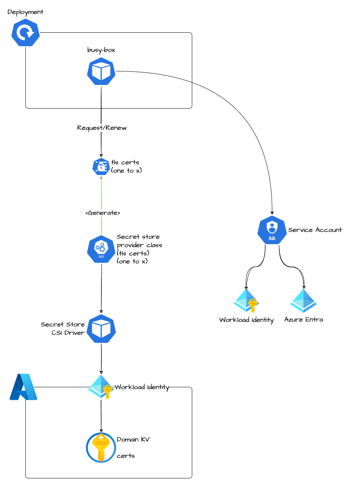

# Architecture

## Helm/Kubernetes Objects

### Deployment

#### PODs

The deployment contains one pod:

1. **alpine/crt-mounter**: util pod used to load the tls certificate for ingress from kv. This was mandatory because we need a way to load the tls cerficate

#### kvCertificatesName

Allows to retrive from the KV the certificates (with its name) and save in kubernetes with the same name (e.g. `my-cert` creates a secret tls with the name `my-cert`). Using secret provider class

## Secret provider class

The secret provider class allows to define:

* which key vault to use
* which kind of secret or certificate to load
* setup azure information to contact the key vault

All the operations are done via the Managed Pod Identity that allows the connection

### Documentation

<https://secrets-store-csi-driver.sigs.k8s.io/concepts.html#secretproviderclass>
<https://secrets-store-csi-driver.sigs.k8s.io/concepts.html>
